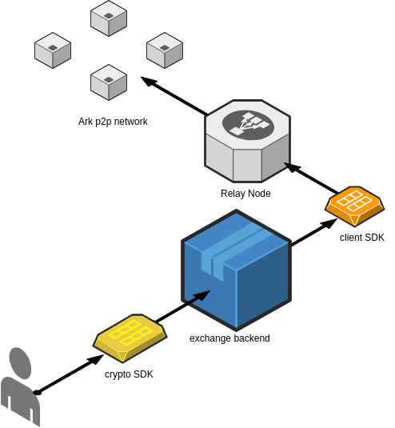
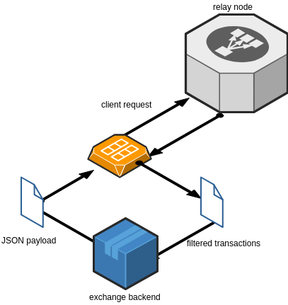

# Public API Guide

Connecting to the API is done via the Crypto and Client SDKs. Many queries can be performed using the Client SDK alone, while the Crypto SDK performs any actions requiring cryptographic functionality \(i.e., signing transactions\).

At a surface level, the two SDKs are separated by their functions and intended use cases:

* The Crypto SDK provides the cryptographic functions necessary to authenticate and validate ARK transactions.
* The Client SDK provides wrapper functions to unify and streamline API calls between your application and the ARK blockchain.

Put another way, the Crypto SDK structures your data in a format that all ARK nodes can understand, while the Client SDK handles the actual communication between your application and an ARK node. Where the Crypto SDK is internal, the Client SDK is external, as the below diagram illustrates:



> Note that the [Public API](https://github.com/ArkEcosystem/gitbooks-exchange/tree/8af5049dc3d84a5f24ac80597529f2d656c651df/api/public/README.md) is only available after a node has fully synced. This ensures your data on the blockchain is up to date.

## Setup

These quick actions will all assume you've loaded a Client instance with the IP address of your node and the API version you're requesting.

> ARK Node \(v1\) has been deprecated. Some references to V1 client constructors may remain for legacy purposes. However, no current clients require you to specify the API Version \(defaults to v2\).

```javascript
const Client = require("@arkecosystem/client");
const exchangeClient = new Client("YOUR.NODE.IP", 2);
```

```java
HashMap<String, Object> map = new HashMap<>();
map.put("host", "http://node-ip:port/api/");
map.put("API-Version", 2);

Connection<Two> connection = new Connection(map);
```

```go
package main

import (
  ark "github.com/ARKEcosystem/go-client/client"
  "net/url"
  )

func main() {
  client := ark.NewClient(nil)
  client.BaseURL, _ = url.Parse("http://{NODE_IP}:{NODE_HOST}/api")
```

```python
from client import ARKClient
client = ARKClient('http://127.0.0.1:4003/api')
```

## Check Wallet Balance

Checking a wallet balance involves using the `wallets` resource to `GET` the wallet corresponding to a given ARK address.

```javascript
const walletAddress = "ARyNwFj7nQUCip5gYt4gSWG6F8evL93eBL";
let wallet;

exchangeClient
  .resource("wallets")
  .get(walletAddress)
  .then(response => {
    wallet = response.data.data;
  })
  .catch(error => {
    console.log(error);
  });

console.log(wallet.balance);
```

```go
...
import "github.com/davecgh/go-spew/spew"

func main() {
  ...
  responseStruct, _, err := client.Wallets.Get(context.TODO(), "ARyNwFj7nQUCip5gYt4gSWG6F8evL93eBL")
  if err != nil {
    log.Panic(err)
  }
  spew.Dump(responseStruct)
}
```

```python
from pprint import pprint

pprint(client.wallets.get(wallet_id='ARyNwFj7nQUCip5gYt4gSWG6F8evL93eBL'))
```

## Find Block Information

If you know the ID of the block you are looking for, you can use the `GET` method on the `blocks` resource to return information on that block.

```javascript
const blockId = 4439278960598580069;
let block;

exchangeClient
  .resource("blocks")
  .get(blockId)
  .then(response => {
    block = response.data.data;
  })
  .catch(error => {
    console.log(error);
  });

console.log(block);
```

```go
func main() {
  ...
  responseStruct, _, err := client.Blocks.Get(context.TODO(), 4439278960598580069)
  if err != nil {
    log.Panic(err)
  }
  spew.Dump(responseStruct)
}
```

```python
pprint(client.blocks.get(block_id='4439278960598580069'))
```

Alternatively, if you are not sure of the block ID, or if you want to find all wallets in a range, you can make use of the `wallets.search` method. This endpoint accepts a JSON object representing the search parameters to use when narrowing down a list of blocks.

The following block properties can be used to create your range:

* timestamp
* height
* numberOfTransactions
* totalAmount
* totalFee
* reward
* payloadLength

To use any of these properties as a range, include the relevant key in your request as an object containing `from` and `to` specifiers.

For example, this code can be used to search all blocks between blockchain heights 720 and 735 with total fees between 0 and 2000 arktoshi:

```javascript
exchangeClient
  .resource("blocks")
  .search({
    height: {
      from: 720,
      to: 735
    },
    totalFee: {
      from: 0,
      to: 2000
    }
  })
  .then(response => {
    console.log(response.data); // all blocks matching the search criteria
  });
```

```go
func main() {
  ...
  responseStruct, _, err := client.Blocks.Search(context.TODO(), ark.BlocksSearchRequest{
    Height: ark.FromTo{From: 720, To: 735},
    TotalFee: ark.FromTo{From: 0, To: 2000},
  })
  if err != nil {
    log.Panic(err)
  }
  spew.Dump(responseStruct)
}
```

```python
pprint(client.blocks.search({
  "height": {"from": 720, "to": 735},
  "totalFee": {"from": 0, "to": 2000},
  }))
```

## Create and Broadcast Transactions

To create transactions, make use of the **transactionBuilder** module of `@arkecosystem/crypto`. First, install the package from npm or your language's equivalent:

```bash
yarn add @arkecosystem/crypto
```

```bash
go get -u github.com/arkecosystem/go-crypto/crypto
```

```bash
pip install arkecosystem-crypto
```

The `crypto` package functionality we'll use here is the transactionBuilder, which provides a series of "chainable" methods that can be called, one after another, to produce a transaction object. These methods create and define your transaction: its type, its amount in arktoshis, its signature, and more.

Regardless of which SDK you use, every transactionBuilder contains a similar function to `getStruct`, which will return a completed transaction object.

After making one or more of these transaction objects, you can combine them into an array to use as the `transactions` key in your request.

With all the steps together, here is an example of how to send a transaction for approval:

```javascript
const crypto = require("@arkecosystem/crypto");
const transactionBuilder = crypto.transactionBuilder;

const transaction = transactionBuilder
  .transfer()
  .amount(2 * Math.pow(10, 8))
  .recipientId(recipientId)
  .sign(passphrase)
  .getStruct();

exchangeClient
  .resource("transactions")
  .create({
    transactions: [transaction]
  })
  .then(response => {
    console.log(response.data);

    if (response.data.errors) {
      errors.forEach(error => {
        console.log(error);
      });
    }
  })
  .catch(error => {
    console.log(error);
  });
```

```go
...
import ark_crypto "github.com/arkecosystem/go-crypto/crypto"

func main() {
  ...
  transaction := ark_crypto.BuildTransfer(
    recipientId,
    uint64(amount),
    "Hello World",
    passphrase,
  )

  // cast is a fictitious helper function which alters ark_crypto.Transaction
  // into an ark_client.CreateTransactionRequest.
  responseStruct, _, err := client.Transaction.Create(context.TODO(), cast(transaction))
  if err != nil {
    log.Panic(err)
  }
  spew.Dump(responseStruct)
}
```

```python
...

from crypto.transactions.builder.transfer import Transfer

tx = Transfer(recipientId=recipientId, amount=1000)
tx.sign(passphrase)
pprint(client.transactions.create([tx]))
```

There are a few things worth noticing about the above code. Firstly, the code assumes that you have declared two variables already:

1. `passphrase` - the passphrase of the sending account, used to sign the transaction. This should come from somewhere secure, such as a `.env` file.
2. `recipientId` - the ARK address of the receiving account. Should be provided by the exchange user when submitting withdrawal requests.

Second, when sending your request using the `exchangeClient`, ensure that the value of `transactions` is an array, even if you have only one transaction object.

If your request is successful, you will receive a response with the following `data` key:

```javascript
{
  data: {
      accept: [ '96e3952b66a370d8145055b55cedc6f1435b3a71cb17334aa954f8844ad1202f' ],
      broadcast: [ '96e3952b66a370d8145055b55cedc6f1435b3a71cb17334aa954f8844ad1202f' ],
      excess: [],
      invalid: []
    },
  errors: null
}
```

Let us look at the returned `data` object in more depth. It is composed of four arrays, each holding zero or more transaction IDs:

1. `accept` - a list of all accepted transactions
2. `broadcast` - a list of all transactions broadcasted to the network
3. `excess` - if the node's transaction pool is full, this lists all excess transactions
4. `invalid` - a list of all transactions deemed invalid by the node

Our sample code above submitted one transaction, which the node accepted and broadcasted and thus the `accept` and `broadcast` arrays contain precisely one item each: the ID of the transaction we submitted.

If we had submitted any invalid transactions, the `invalid` list would have contained their IDs, and the `errors` key would have been populated with one error per invalid transaction.

The diagram below offers a top-level overview of the transaction submission process:



## Check Transaction Confirmations

Once a transaction has been created and added to the blockchain, you can access the number of confirmations it has by using the `transactions` resource to `get` the value matching the transaction ID.

```javascript
const transactionId =
  "9085b309dd0c20c12c1a00c40e1c71cdadaa74476b669e9f8a632db337fb6915";

exchangeClient
  .resource("transactions")
  .get(transactionId)
  .then(response => {
    console.log(response.data);
  });
```

```go
...

func main() {
  ...
  txID := "9085b309dd0c20c12c1a00c40e1c71cdadaa74476b669e9f8a632db337fb6915"
  responseStruct, _, err := client.Transactions.Get(context.TODO(), txID)
  if err != nil {
    log.Panic(err)
  }
  spew.Dump(responseStruct)
}
```

```python
txID = "9085b309dd0c20c12c1a00c40e1c71cdadaa74476b669e9f8a632db337fb6915"
pprint(client.transactions.get(transaction_id=txID))
```

If the transaction has been added to the blockchain, you'll receive the following data structure in your console:

```javascript
{
  data: {
    id: 'a4d3d3ab059b8445894805c1158f06049a4200b2878892e18d95b88fc57d0ae5',
    blockId: '7236620515792246272',
    version: 1,
    type: 0,
    amount: 200000000,
    fee: 10000000,
    sender: 'ANBkoGqWeTSiaEVgVzSKZd3jS7UWzv9PSo',
    recipient: 'AbfQq8iRSf9TFQRzQWo33dHYU7HFMS17Zd',
    signature: '304402206f1a45d0e8fadf033bfd539ddf05aa33ca296813f30a72a0e17d560e2d04ba8e02204a2525972d14bb3da407a04f2b9d797747a4eb99ff547e4803f60143f6a68543',
    confirmations: 0,
    timestamp: {
      epoch: 54759242,
      unix: 1544860442,
      human: '2018-12-15T07:54:02.000Z'
    }
  }
}
```

You can see that the `confirmations` key holds the number of confirmations this transaction has received from the network, in the above case 0. As the average block takes 8 seconds to forge, finality is typically established within a minute following a transaction's addition to the blockchain.

## Check Node Status

Checking node status can be done by using the `node` resource's `status` method:

```javascript
exchangeClient
  .resource("node")
  .status()
  .then(response => {
    console.log(response.data);
  });
```

```go
...

func main() {
  ...
  responseStruct, _, err := client.Node.Status(context.TODO())
  if err != nil {
    log.Panic(err)
  }
  spew.Dump(responseStruct)
}
```

```python
pprint(client.node.status())
```

By running this code, you'd see the output in your console resembling the following object:

```javascript
{
  data: {
    synced: true,     // whether this node is fully synchronized with the network
    now: 14468,       // the current network height of this node's blockchain
    blocksCount: 0    // if not synced, the number of blocks yet to be synced
  }
}
```

If `synced` is true, your node is operating as expected and fully synced with the ARK network. Otherwise, use the `blocksCount` key to get an estimation of how long your node will take to sync.

